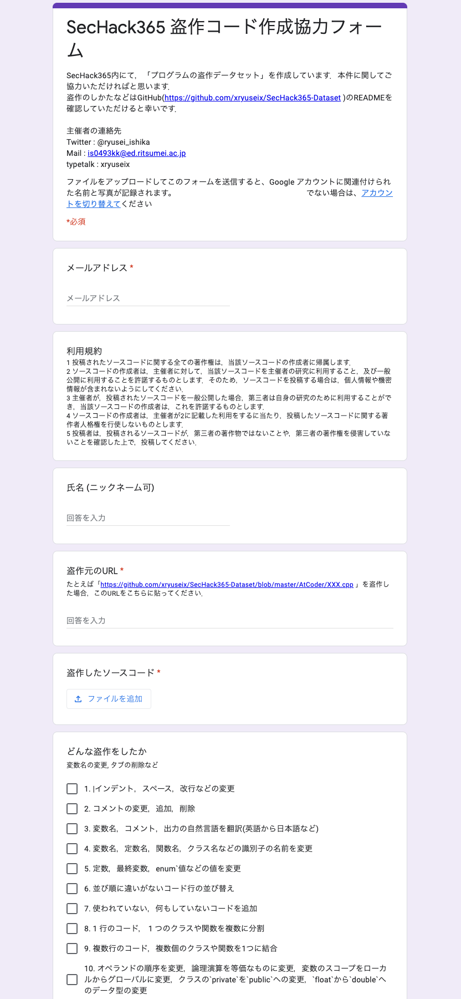

# SecHack365 盗作用ソースコード

## 利用規約

1 投稿されたソースコードに関する全ての著作権は，当該ソースコードの作成者に帰属します．  
2 ソースコードの作成者は，主催者に対して，当該ソースコードを主催者の研究に利用すること，及び一般公開に利用することを許諾するものとします．そのため，ソースコードを投稿する場合は，個人情報や機密情報が含まれないようにしてください．  
3 主催者が，投稿されたソースコードを一般公開した場合，第三者は自身の研究のために利用することができ，当該ソースコードの作成者は，これを許諾するものとします．  
4 ソースコードの作成者は，主催者が2に記載した利用をするに当たり，投稿したソースコードに関する著作者人格権を行使しないものとします．  
5 投稿者は，投稿されるソースコードが，第三者の著作物ではないことや，第三者の著作権を侵害していないことを確認した上で，投稿してください．

## 盗作手順

ご協力ありがとうございます．以下の手順にしたがって盗作いただければと思います．

1. [以下のフォルダ](./AtCoder/)から適当に 1 つのソースコードを選んで，盗作してください．その際，ソースコードのURLも保管しておいてください．
2. google form(URLは別途typetalkに記載)にソースコードのURL，盗作したソースコードなどを記載の上，送信してください．



何か不明点などがあればtypetalkなどでご連絡いただけると幸いです．

## Q&A

### 1. プログラムを実行したいです．

コンパイラは以下のものを使用しています．

```sh
Apple clang version 11.0.3 (clang-1103.0.32.29)
```

また，すべてのコードはこれでコンパイルできるはずです．一部，C++17が必要なコードも含まれます．

```sh
g++ -std=c++1z -fsanitize=address -D_GLIBCXX_DEBUG -fsanitize=undefined -D_GLIBCXX_DEBUG_PEDANTIC -o a.out -I . [ファイル名].cpp
```

ただし，ソースコード中に

```cpp
#include <atcoder/all>
using namespace atcoder;
```

が入っている場合，AtCoder Libraryを使用しています(ほんの一部のソースコードだと思われます)．環境がない場合は別のコードを盗作していただくか，[AtCoder公式ぺージ](https://atcoder.jp/posts/517)を参考に，AtCoder Libraryを導入してください(少し面倒です)．

### 2. プログラムがバグってます/謎の変な文字が入ってます

こちら側での加工/整形ミスだと思われます．報告していただけるとありがたいです．

### 3. 盗作に決まりはありますか？

AtCoderでそのまま提出すれば正解できるようにしていただきたいです．別に提出していただく必要はないのですが，以下の項目に気をつけてください(あまり気にしないでいただいて結構です)．

* C++の構文で盗作してください．バージョンは問いません．
* 1秒以上の無駄なsleep/waitはおやめください．
* ソースコードに長すぎる(計 50,000 文字以上の)無駄すぎる行を追加しないでください．単純に冗長にするのは大歓迎です．google formがエラーを出さなければOKです( 5,000 文字です)．5,000 文字以上，50,000 文字以下で盗作した場合は僕にtypetalkのDMなどで送っていただければ幸いです．多少多くても構わないので，その際はご連絡いただければと思います．
* メモリの大量の無駄遣いはおやめください．1,024 MBくらいにおさまるようお願いします．(故意で無駄にメモリを使用しない限り問題ありません．`int A[1000000000000];`のようなコードは控えて頂きたいです．)
* ソースコードの最初の方にコメントアウトで情報がついています(例は以下のコード)．盗作する際，これは消しても構わないのですが，盗作前に「引用元：」には可能な限りアクセスしないようお願いします(盗作ではなく，自力で問題を解いてしまう可能性があるため)．

```cpp
/*
引用元：https://atcoder.jp/contests/abc018/tasks/abc018_3
C - 菱型カウント
// ソースコードの引用元 : https://atcoder.jp/contests/abc018/submissions/8330584
// 提出ID : 8330584
// 問題ID : abc018_3
// コンテストID : abc018
// ユーザID : xryuseix
// コード長 : 3094
// 実行時間 : 16
*/
```

### 4. 既に無駄なincludeが入ってます

すみませんが，競技プログラミングではコンテスト時間が決まっているので，あらかじめ必要そうなファイルを`#include`したり，マクロを定義したりすることがあります．他にも余計なコメントアウトや雑な変数名などがあり，非常に汚いと思うのですが，ご容赦ください．そのようなコードは消していただいても，そのままでも構いません．

### 5. どんな盗作が考えられますか？

以下の項目を参考にしてください．別に従う必要はありません．

1. インデント，スペース，改行などの変更
```cpp
    int a=33;
```
↓
```cpp
int a = 
33;
```

2. コメントの変更，追加，削除
```cpp
// コメント
```
↓
```cpp
/* コメ編集ント */
// コメント追加！
```

3. 変数名，コメント，出力の自然言語を翻訳(英語から日本語など)
```cpp
// This is integer!
int number = 3;
```
↓
```cpp
// これは数字！
int suuji = 3;
```

4. 変数名，定数名，関数名，クラス名などの識別子の名前を変更
```cpp
int number;
```
↓
```cpp
int integer;
```

5. 定数，最終変数，`enum`値などの値を変更
```cpp
char c = 'A';
std::pair<int, int> p = {1, 2};
```
↓
```cpp
char c = 'C';
std::pair<int, int> p = {200000, 1010101};
```

6. 並び順に違いがないコード行の並び替え
```cpp
int itigyoume = 1;
int nigyoume = 2;
```
↓
```cpp
int nigyoume = 2;
int itigyoume = 1;
```

7. 使われていない，何もしていないコードを追加
```cpp
for(int i = 0; i < 10; i ++) {
    std::cout << i << std::endl;
}
```
↓
```cpp
for(int i = 0; i < 10; i ++) {
    std::cout << i << std::endl;
    int muda = i * 2;
}
```

8. 1 行のコード， 1 つのクラスや関数を複数に分割
```cpp
int main() {
    int ans = 0;
    for(int i = 0; i < 10; i++) {
        ans += i;
    }
    std::cout << ans << std::endl;
}
```
↓
```cpp
int loop() {
    int ans = 0;
    for(int i = 0; i < 10; i++) {
        ans += i;
    }
    return ans;
}
int main() {
    int ans = loop();
    std::cout << ans << std::endl;
}
```

9. 複数行のコード，複数個のクラスや関数を1つに結合
```cpp
int loop() {
    int ans = 0;
    for(int i = 0; i < 10; i++) {
        ans += i;
    }
    return ans;
}
int main() {
    int ans = loop();
    std::cout << ans << std::endl;
}
```
↓
```cpp
int main() {
    int ans = 0;
    for(int i = 0; i < 10; i++) {
        ans += i;
    }
    std::cout << ans << std::endl;
}
```

10. オペランドの順序を変更，論理演算を等価なものに変更，変数のスコープをローカルからグローバルに変更，クラスの`private`を`public`への変更，`float`から`double`へのデータ型の変更
```cpp
int main() {
    float a = 3 + 1 * 2.0;
}
```
↓
```cpp
double a = 2.0 * 1 + 3;
int main() {

}
```

11. 制御構造体のおきかえ (`for`の代わりに`while`を，`if`の代わりに`switch`など)
```cpp
for(int i = 0; i < 10; i++) {
    std::cout << i << std::endl;
}
```
↓
```cpp
int i = 0;
while(i < 10) {
    std::cout << i << std::endl;
    i++;
}
```

12. 不要なコード行の削除など，単純化
```cpp
int ans = 0;
for(int i = 0; i < n; i++) {
    ans += i;
}
```
↓
```cpp
int ans = n * (n - 1) / 2;
```

13. 大まかなロジックだけコピーして，残りは自分で書く
```cpp
int kansuu1() {
    // A
}
int kansuu2() {
    // B
}
int main() {
    int a = kansuu1();
    int b = kansuu2();
    std::cout << a + b << std::endl;
}
```
↓
```cpp
int kansuu1() {
    // C
}
int kansuu2() {
    // D
}
int main() {
    int a = kansuu1();
    int b = kansuu2();
    std::cout << a + b << std::endl;
}
```

14. 関数やクラスなどをコピーしてオリジナルのコードと結合
```cpp
// ~~
class SaikyouClass {
    // クラス丸ごとコピーするぜ
};
// ~~
```
↓
```cpp
class SaikyouClass {

};
int main() {
    SaikyoClass ore;
}
```
### 6. C++のバージョンはAtCoderの提出時に準拠という認識であっていますか？例えば盗作元の提出時はC++14 (GCC 5.4.1)が使われているが、現在AtCoderで提供されているC++はGCC 9.2.1とClang 10.0.0 のみというケースがあります

はい，その認識で問題ございません．
